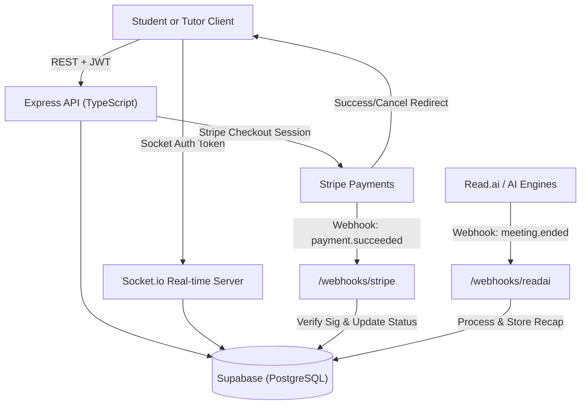

# EduBook — Professional Tutor Marketplace Platform

A robust, enterprise-grade tutoring platform architecture built for scalability and real-time engagement. This repository contains the complete full-stack implementation mirroring the Edukko platform, featuring automated scheduling, secure payments, and AI-driven session recaps.

---

## 🏗 System Architecture



---

## 🚀 Core Features

### 📅 Advanced Scheduling
*   **Google Calendar Bi-directional Sync:** Automatic event creation, rescheduling, and deletion via OAuth2.
*   **Google Meet Integration:** Real-time generation of unique meeting links for every booking.
*   **Conflict Detection:** Server-side logic prevents tutor double-booking at the database level.

### 💳 Financial Integrity
*   **Stripe Checkout Integration:** Optimized payment flow for tutors and students.
*   **Automated Refunds:** Programmatic refund handling via Stripe API if a confirmed session is cancelled by a tutor.
*   **Webhook Verification:** Secure signature validation for all payment events to prevent financial fraud.

### 💬 Real-Time Engagement
*   **Session-Scoped Chat:** Real-time messaging powered by Socket.io with persistent message history stored in PostgreSQL.
*   **Typing Indicators & Presence:** Live "who's online" and "is typing" status for improved user experience.

### 🤖 AI-Powered Progress
*   **Read.ai Webhook Ingestion:** Automated ingestion of meeting transcripts, summaries, and action items.
*   **Learning Analytics:** Structured storage of AI-generated insights to track student progress over time.

---

## 🛠 Tech Stack

*   **Frontend:** Next.js 15+, React 19 (Server/Client components), Tailwind CSS 4.
*   **Backend:** Node.js, Express.js 4, TypeScript 5.
*   **Database:** PostgreSQL (Supabase) with Row Level Security (RLS).
*   **Real-time:** Socket.io with JWT authentication.
*   **Integrations:** Stripe API, Google Calendar OAuth2, Read.ai.

---

## 📦 Getting Started

### 1. Installation
```bash
git clone https://github.com/Michaelgeo1004/EduBook-Scaling-Edukko.git
cd EduBook-Scaling-Edukko
npm install
cd frontend && npm install
```

### 2. Environment Configuration
Create a `.env` file in the root directory:
```env
PORT=4000
FRONTEND_URL=http://localhost:3000
JWT_SECRET=your_jwt_secret

# Infrastructure
SUPABASE_URL=your_supabase_url
SUPABASE_SERVICE_ROLE_KEY=your_service_role_key

# Payments
STRIPE_SECRET_KEY=your_stripe_secret
STRIPE_WEBHOOK_SECRET=your_webhook_secret

# Calendar
GOOGLE_CLIENT_ID=your_google_id
GOOGLE_CLIENT_SECRET=your_google_secret

# AI
READAI_WEBHOOK_SECRET=your_readai_secret
```

### 3. Execution
```bash
# Start Backend
npm run dev

# Start Frontend
cd frontend
npm run dev
```

---

## 🛡 Security & Best Practices

*   **JWT Authentication:** All protected routes are guarded by role-based access control (Student vs. Tutor vs. Admin).
*   **Database RLS:** Critical data is protected by Supabase Row Level Security policies.
*   **Webhook Validation:** All inbound hooks (Stripe/Read.ai) are verified using secure signature matching.
*   **Monorepo Design:** Centralized versioning for frontend and backend services.

---

## 🎯 Project Roadmap & Conclusion

This project mirrors the core architecture of the Edukko platform, taking it from an MVP to a launch-ready environment. The focus is on robust scheduling, financial safety, and AI-driven insights for the future of EdTech.
